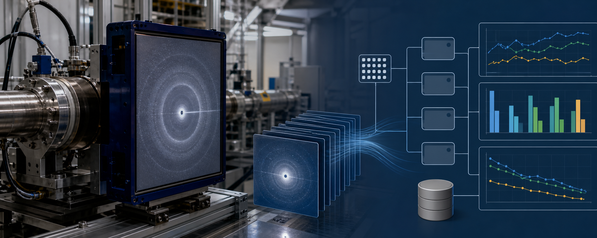

<p align="center">
  
</p>

# From Experiment to Insight

> KTH MSc Thesis in Computer Science: benchmarking cloud-native storage formats for large-scale synchrotron and neutron scattering data on AWS S3.

This repository contains the final thesis PDF, LaTeX source, experiment notebooks, generated figures, benchmark tables, and presentation material for a comparative study of scientific storage formats on AWS S3. The work evaluates how storage layout and codec choice affect interactive single-frame reads, full sequential scans, request intensity, and stored size for a synthetic detector stack derived from real beamline frames.

**Full thesis PDF:** [KTH_MSc_Thesis_Cloud_Native_Storage_Benchmarking_Casper_Kristiansson.pdf](KTH_MSc_Thesis_Cloud_Native_Storage_Benchmarking_Casper_Kristiansson.pdf)

## Abstract

Modern synchrotron and neutron beamlines can stream at gigabytes per second, turning single experiments into multi-terabyte datasets and exposing latency limits of parallel file systems. This thesis benchmarks cloud-native storage layouts on AWS S3 using a single synthetic approximately 20 GiB, approximately 1,300-frame detector stack generated from 80 real CBF seed frames, focusing on slice-level latency, scan throughput, and cost drivers. Four backends (HDF5 via HSDS, Zarr v3, TileDB, ROOT/TTree) and three codecs (gzip, LZ4, zstd) are evaluated under two workloads: random single-frame reads and full sequential scans. Client timings are analyzed on a log scale with dependence-robust confidence intervals, with S3 request counts and stored size providing context.

Results are descriptive and session-conditional for this dataset and AWS setup. For interactive slices, Zarr is fastest with zstd (GM approximately 155 ms) and with LZ4; TileDB is fastest with gzip. For full scans, TileDB completes the same logical dataset in 2.2-3.2x lower GM scan time than Zarr across codecs; the transferred-byte throughput summaries follow the same ordering (for example, zstd approximately 1.06 GiB/s for 20 GiB). ROOT/TTree is slow for frame-random reads despite a few GETs, indicating single-object paging and decode overheads. HDF5/HSDS trails on slice latency and scan throughput with LZ4, storing 19.17 GiB versus Zarr 10.40 GiB for the same payload.

The contribution is a reproducible AWS-native benchmarking method and a decision matrix for the tested synthetic detector stack and workloads: choose Zarr+zstd when slice latency dominates, and choose TileDB+zstd/LZ4 when throughput dominates.

## Keywords

KTH master thesis, MSc thesis computer science, cloud-native storage, scientific data management, AWS S3 benchmarking, object storage, synchrotron data, neutron scattering data, detector data, HDF5, HSDS, Zarr, TileDB, ROOT, TTree, Parquet, compression codecs, gzip, LZ4, zstd, random reads, full scans, latency, throughput, request cost, GETs per GiB, storage footprint, decision matrix.

## Why This Repository Exists

Large-scale scattering experiments increasingly need cloud-accessible storage without losing interactive performance. This repository documents a reproducible benchmark for researchers, beamline scientists, facility operators, and data engineers who need to choose between HDF5/HSDS, Zarr, TileDB, and ROOT/TTree for object-store-based scientific workflows.

The central question is practical: which storage layout and compression codec should be used when a dataset must support both low-latency frame reads and high-throughput full-dataset scans on AWS S3?

## What This Compares

The benchmark holds one detector-style workload fixed and compares four timed storage backends across three codecs:

| Storage path | Layout idea | Role in the study |
| --- | --- | --- |
| HDF5 via HSDS | HDF5 data model exposed through a REST service and S3-backed chunks | Compatibility-oriented baseline |
| Zarr v3 | Chunk-per-object array storage | Low-latency cloud-native array layout |
| TileDB | Fragment-backed dense array storage | High-throughput scan-oriented layout |
| ROOT/TTree | Single-object tree/column storage | High-energy-physics inspired single-file layout |

Codecs: `gzip`, `lz4`, and `zstd`.

Workloads:

- Random single-frame reads, representing interactive slice access.
- Full sequential scans, representing batch processing or reprocessing.
- Storage/request accounting, including stored GiB, object counts, GETs per GiB, and S3 service latencies.

## Result Snapshot

<p align="center">
  
</p>

For the `zstd` condition, Zarr is the strongest latency-first choice for single-frame reads, while TileDB is the strongest full-scan choice. The central message is not that one format wins everywhere, but that layout interacts strongly with access pattern.

<p align="center">
  
</p>

Stored size is mostly codec-driven, but the evaluated HSDS + `lz4` path is a storage-heavy outlier in this dataset.

<p align="center">
  
</p>

The thesis treats these results as descriptive and session-conditional: they are evidence for this dataset, client, AWS region, implementation stack, and measurement window.

## Main Takeaways

- **Latency-first interactive analysis:** Zarr with `zstd` is the strongest default for random single-frame reads in this benchmark.
- **Throughput-first batch processing:** TileDB with `zstd` is the strongest default for full sequential scans.
- **Storage footprint:** Stored size is mostly codec-driven, but implementation details matter; the evaluated HSDS + `lz4` path stores substantially more data than Zarr + `lz4`.
- **Request behavior:** Low GET counts alone do not guarantee good performance; ROOT/TTree has few GETs but poor frame-random latency because paging and decode overhead dominate.
- **Interpretation:** Results are descriptive, session-conditional, and scoped to one AWS region, one client setup, and one detector-style dataset.

## Repository Map

```text
.
|-- KTH_MSc_Thesis_Cloud_Native_Storage_Benchmarking_Casper_Kristiansson.pdf
|-- Experiment/
|   |-- data_generation.ipynb      # Data ingestion and format construction
|   |-- data_reader.ipynb          # Read workload execution
|   |-- plots.ipynb                # Tables and figure generation
|   |-- requirements.txt           # Python dependencies for the experiment stack
|   |-- Experiment Result/         # Timed run logs and CloudWatch session exports
|   |-- figures/                   # Experiment-generated figures
|   `-- tables/                    # CSV tables used by the report
|-- Report/
|   |-- Thesis.tex                 # Main thesis source
|   |-- Report.pdf                 # Built thesis PDF snapshot
|   |-- figures/graphs/            # Report-ready figures
|   |-- lib/                       # Glossary, acronyms, and LaTeX helpers
|   `-- references.bib             # Bibliography
|-- Presentation/
|   |-- Internal.pptx
|   `-- Thesis Defence.pptx
|-- Proposal/
|-- Individual Plan/
`-- docs/readme-assets/            # README banner and summary SVGs
```

## Reproduce the Analysis

Create a Python environment and install the experiment dependencies:

```bash
python3 -m venv .venv
source .venv/bin/activate
python -m pip install -r Experiment/requirements.txt
```

The notebooks are the main execution surface:

```bash
python -m pip install jupyterlab
jupyter lab Experiment/data_generation.ipynb Experiment/data_reader.ipynb Experiment/plots.ipynb
```

Notes:

- `Experiment/data_generation.ipynb` also uses ROOT/PyROOT, which must be installed from the CERN ROOT distribution.
- The AWS-backed runs depend on local credentials and environment configuration. Do not commit `.env` files or cloud credentials.
- Existing result logs and generated CSV tables are already present under `Experiment/Experiment Result/` and `Experiment/tables/`.

## Build the Thesis PDF

The report source lives in `Report/Thesis.tex`. With a full LaTeX toolchain installed:

```bash
cd Report
latexmk -pdf Thesis.tex
```

The document uses bibliography, glossaries, nomenclature, and many generated figures, so a complete TeX distribution is recommended. The repository also includes the final thesis PDF in the repository root and a built snapshot at `Report/Report.pdf`.

## Key Artifacts

| Artifact | Path |
| --- | --- |
| Final thesis PDF | `KTH_MSc_Thesis_Cloud_Native_Storage_Benchmarking_Casper_Kristiansson.pdf` |
| Thesis source | `Report/Thesis.tex` |
| Thesis PDF snapshot | `Report/Report.pdf` |
| Main plotting notebook | `Experiment/plots.ipynb` |
| Benchmark result logs | `Experiment/Experiment Result/` |
| Generated result tables | `Experiment/tables/` |
| Report figures | `Report/figures/graphs/` |
| Defence slides | `Presentation/Thesis Defence.pptx` |

## README Artwork

The top banner was generated with the built-in image generation tool for this repository. The summary charts in `docs/readme-assets/` are deterministic SVGs derived from the existing benchmark CSV tables.

Final banner prompt summary: a wide scientific-educational README hero showing synchrotron detector data flowing into cloud object storage and benchmark visualizations, with no embedded text or logos.
