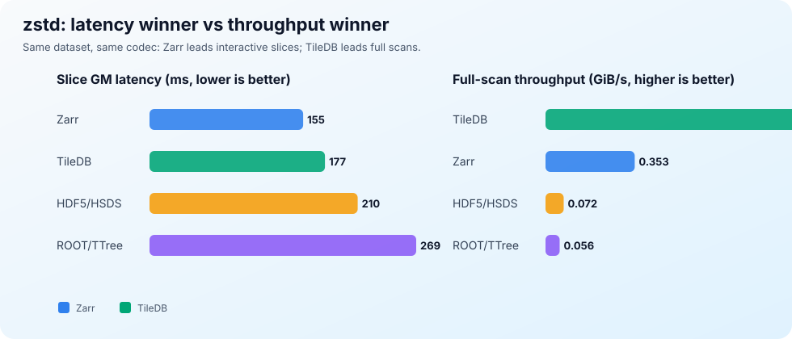
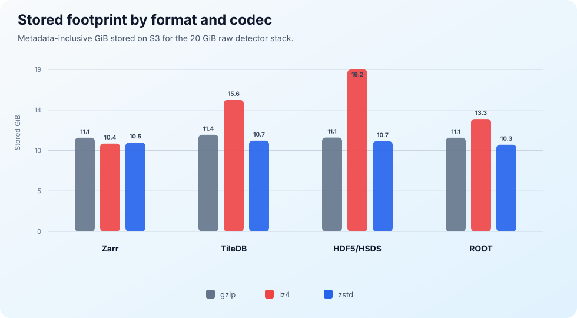
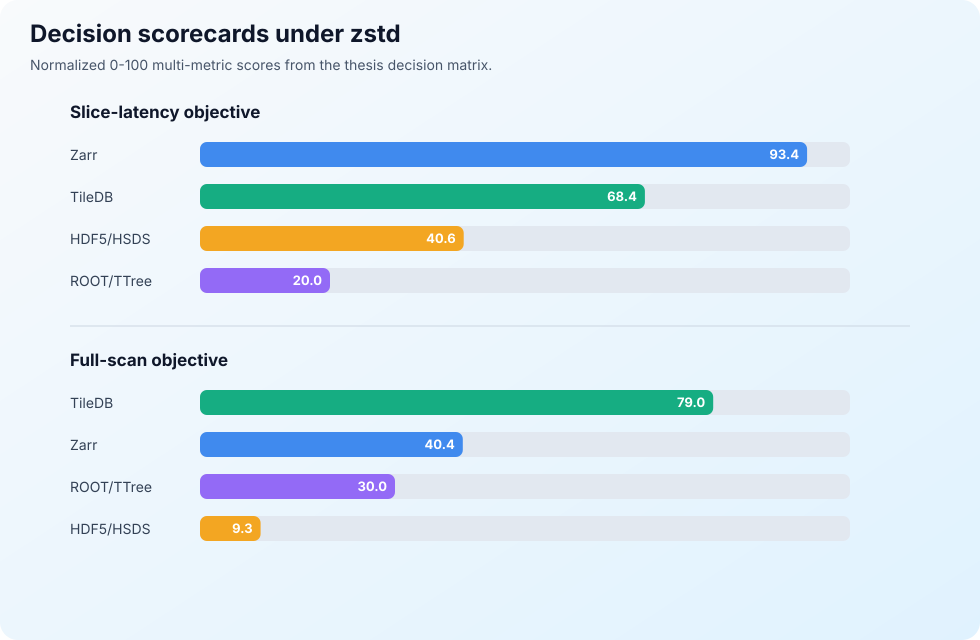

<p align="center">
  
</p>

# From Experiment to Insight

> A KTH MSc thesis repository for benchmarking cloud-native storage approaches for large-scale synchrotron and neutron scattering data.

This repository contains the thesis report, experiment notebooks, generated figures, benchmark tables, and presentation material for a comparative study of storage formats on AWS S3. The work evaluates how storage layout and codec choice affect interactive single-frame reads, full sequential scans, request intensity, and stored size for a synthetic detector stack derived from real beamline frames.

## What This Compares

The benchmark holds one detector-style workload fixed and compares four timed storage backends across three codecs:

| Storage path | Layout idea | Role in the study |
| --- | --- | --- |
| HDF5 via HSDS | HDF5 data model exposed through a REST service and S3-backed chunks | Compatibility-oriented baseline |
| Zarr v3 | Chunk-per-object array storage | Low-latency cloud-native array layout |
| TileDB | Fragment-backed dense array storage | High-throughput scan-oriented layout |
| ROOT/TTree | Single-object tree/column storage | High-energy-physics inspired single-file layout |

Codecs: `gzip`, `lz4`, and `zstd`.

Workloads:

- Random single-frame reads, representing interactive slice access.
- Full sequential scans, representing batch processing or reprocessing.
- Storage/request accounting, including stored GiB, object counts, GETs per GiB, and S3 service latencies.

## Result Snapshot

<p align="center">
  
</p>

For the `zstd` condition, Zarr is the strongest latency-first choice for single-frame reads, while TileDB is the strongest full-scan choice. The central message is not that one format wins everywhere, but that layout interacts strongly with access pattern.

<p align="center">
  
</p>

Stored size is mostly codec-driven, but the evaluated HSDS + `lz4` path is a storage-heavy outlier in this dataset.

<p align="center">
  
</p>

The thesis treats these results as descriptive and session-conditional: they are evidence for this dataset, client, AWS region, implementation stack, and measurement window.

## Repository Map

```text
.
|-- Experiment/
|   |-- data_generation.ipynb      # Data ingestion and format construction
|   |-- data_reader.ipynb          # Read workload execution
|   |-- plots.ipynb                # Tables and figure generation
|   |-- requirements.txt           # Python dependencies for the experiment stack
|   |-- Experiment Result/         # Timed run logs and CloudWatch session exports
|   |-- figures/                   # Experiment-generated figures
|   `-- tables/                    # CSV tables used by the report
|-- Report/
|   |-- Thesis.tex                 # Main thesis source
|   |-- Report.pdf                 # Built thesis PDF snapshot
|   |-- figures/graphs/            # Report-ready figures
|   |-- lib/                       # Glossary, acronyms, and LaTeX helpers
|   `-- references.bib             # Bibliography
|-- Presentation/
|   |-- Internal.pptx
|   `-- Thesis Defence.pptx
|-- Proposal/
|-- Individual Plan/
`-- docs/readme-assets/            # README banner and summary SVGs
```

## Reproduce the Analysis

Create a Python environment and install the experiment dependencies:

```bash
python3 -m venv .venv
source .venv/bin/activate
python -m pip install -r Experiment/requirements.txt
```

The notebooks are the main execution surface:

```bash
python -m pip install jupyterlab
jupyter lab Experiment/data_generation.ipynb Experiment/data_reader.ipynb Experiment/plots.ipynb
```

Notes:

- `Experiment/data_generation.ipynb` also uses ROOT/PyROOT, which must be installed from the CERN ROOT distribution.
- The AWS-backed runs depend on local credentials and environment configuration. Do not commit `.env` files or cloud credentials.
- Existing result logs and generated CSV tables are already present under `Experiment/Experiment Result/` and `Experiment/tables/`.

## Build the Thesis PDF

The report source lives in `Report/Thesis.tex`. With a full LaTeX toolchain installed:

```bash
cd Report
latexmk -pdf Thesis.tex
```

The document uses bibliography, glossaries, nomenclature, and many generated figures, so a complete TeX distribution is recommended. The repository also includes a built snapshot at `Report/Report.pdf`.

## Key Artifacts

| Artifact | Path |
| --- | --- |
| Thesis source | `Report/Thesis.tex` |
| Thesis PDF snapshot | `Report/Report.pdf` |
| Main plotting notebook | `Experiment/plots.ipynb` |
| Benchmark result logs | `Experiment/Experiment Result/` |
| Generated result tables | `Experiment/tables/` |
| Report figures | `Report/figures/graphs/` |
| Defence slides | `Presentation/Thesis Defence.pptx` |

## README Artwork

The top banner was generated with the built-in image generation tool for this repository. The summary charts in `docs/readme-assets/` are deterministic SVGs derived from the existing benchmark CSV tables.

Final banner prompt summary: a wide scientific-educational README hero showing synchrotron detector data flowing into cloud object storage and benchmark visualizations, with no embedded text or logos.
